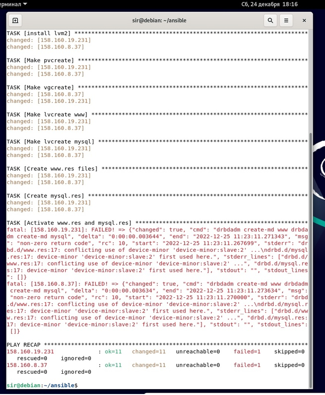
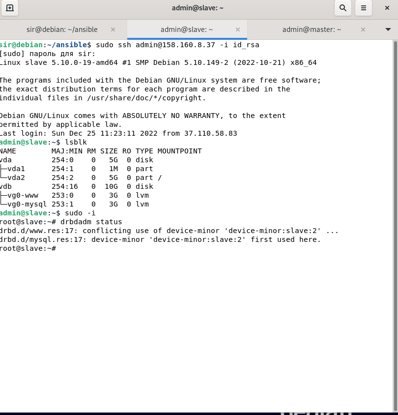
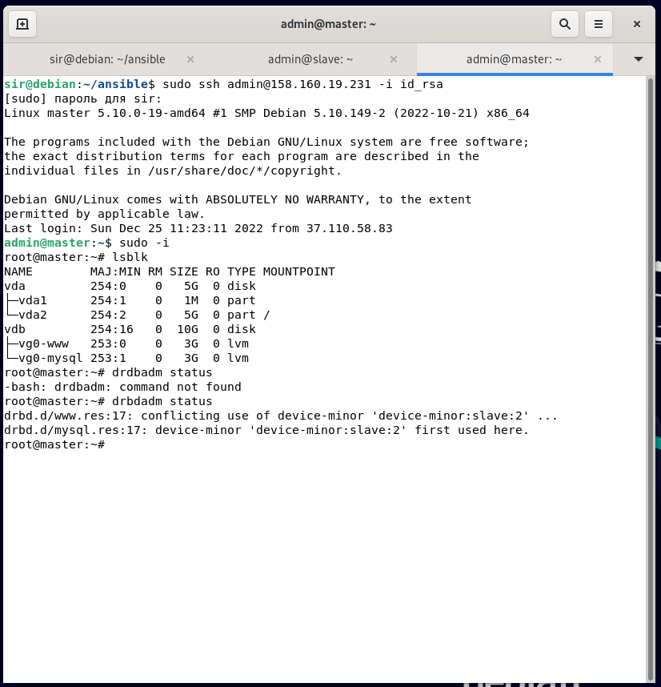
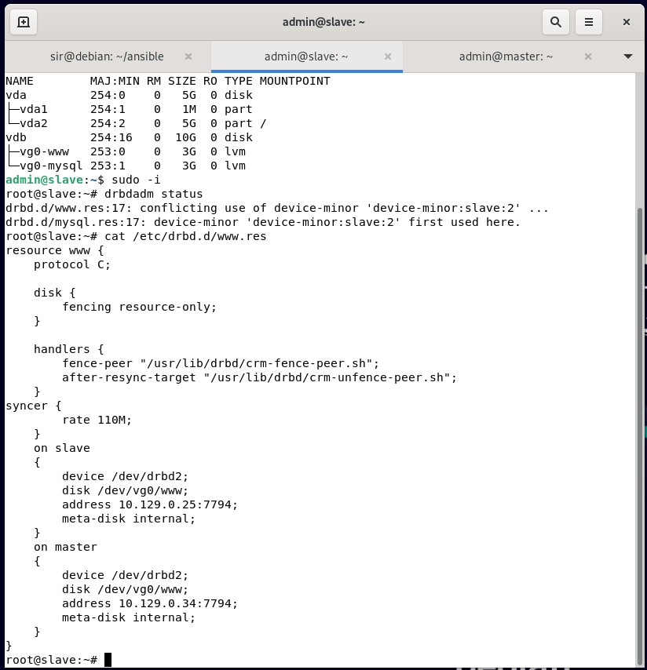

# Вопросы по DRBD к домашнему заданию "Pacemaker" - Серебряков Руслан

### Вопросы:

Я очень старался сам справиться с drbd, пересматривал лекцию, по несколько раз читал презентацию... 
Я повторял одни и теже действия достаточно, чтобы вскипеть и начать использовать ansible =) для настройки виртуальных машин.
Я гуглил ошибки, пытался искать в документации (кстати, по пути о котором говорил преподаватель Александр Зубарев - нет документации которая показана в лекции).
Но в последние разы я столкнулся с тем, что не понимаю что я делаю не так. Делая по лекциям, по презентации, опираясь на статьи в интернете - у меня все равно выходят ошибки.

И вот они:
При запуске fill_playbook_for_create_all.yaml

---
Пробую посмотреть статус при помощи drbdadm status

Попробую сделать действие, которое привело к ошибкам на master и slave, вручную.

Содержимое файла www.res

---

Я бы хотел связаться с преподавателем, чтобы не отправлять работу просто для того, чтобы задать пару вопросов. 
Мой дискорд: Serebryakov R. R. SYS-14#7775
Телеграм: https://t.me/TaraTara321

